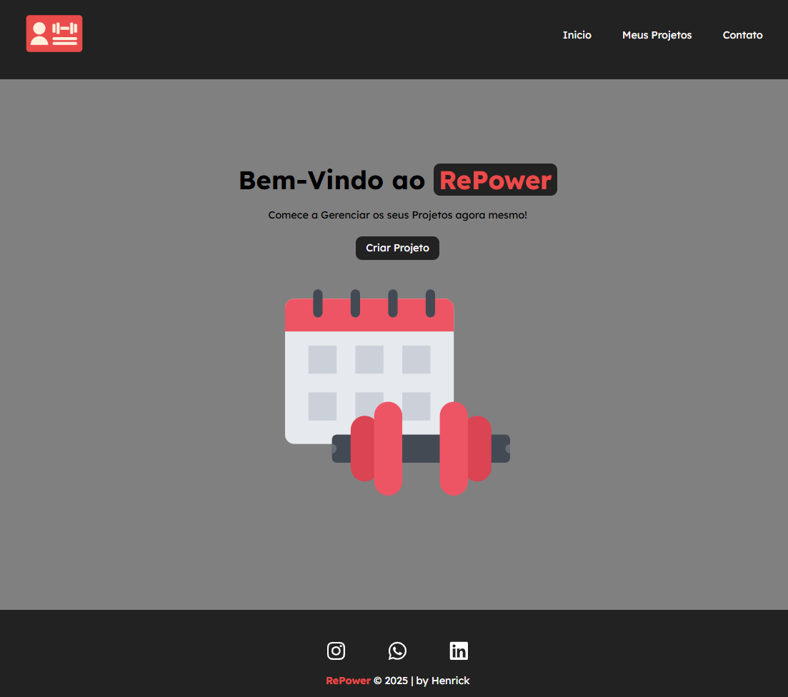

# RePower

  
  
  

---

**RePower** é uma aplicação web desenvolvida em **React** que simula a gestão de projetos.  
Usando o **JSON Server** como backend fake, permite criar, listar e categorizar projetos de forma simples e prática.

---

## 🚀 Tecnologias utilizadas

- **React** (v19.1.0)
- **React Router DOM** (v7.5.2)
- **React Icons**
- **JSON Server** (v1.0.0-beta.3)
- **UUID** (v11.1.0)
- **JavaScript** (ES6+)
- **HTML5**
- **CSS3**

---

## 🛠️ Como rodar o projeto

1. **Clone o repositório**
   ```bash
   git clone https://github.com/seu-usuario/repower.git
   cd repower
   ```

2. **Instale as dependências**
   ```bash
   npm install
   ```

3. **Inicie o backend (JSON Server)**
   ```bash
   npm run backend
   ```
   O servidor será iniciado na porta **5000**:  
   Acesse: [http://localhost:5000/projetos](http://localhost:5000/projetos)

4. **Inicie o frontend (React App)**
   ```bash
   npm start
   ```
   A aplicação abrirá automaticamente em [http://localhost:3000](http://localhost:3000).

---

## 📄 Sobre o banco de dados (db.json)

O arquivo `db.json` contém:
- **Projetos** (`/projetos`)
- **Categorias** (`/categories`)

Esses dados são usados para listar e categorizar os projetos dentro da aplicação.

---

## ✨ Funcionalidades principais

- Cadastro de novos projetos.
- Visualização de projetos existentes.
- Organização dos projetos por categoria.
- Integração com backend fake para persistência dos dados.

---

## 📚 Scripts disponíveis

| Comando           | Função                                |
| ----------------- | ------------------------------------- |
| `npm start`       | Inicia o servidor React               |
| `npm run backend` | Inicia o JSON Server (porta 5000)     |

---

## 🖼️ Prévia do Projeto

```markdown

```
---

## 🧑‍💻 Desenvolvido por

Henrick de Lima Borba  
[LinkedIn](https://www.linkedin.com/in/henrick-brb/)

---

### 🎯 Futuras melhorias

- Melhorar design responsivo.
- Integração com APIs reais (futuramente).
